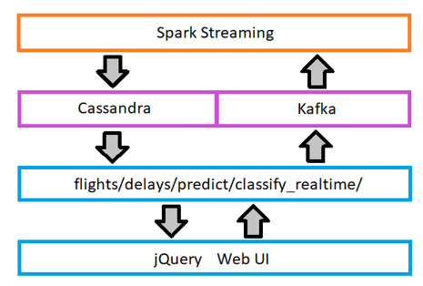

# Lambda-Architecture-ML
In this project, using lambda architecture, I trained a classifier model in batch layer and loaded the trained model in speed/streaming layer to serve the real-time flight arrival delay predictions. 
* Author : Kolli Nethre Sai
## What is Lambda Architecture?
Lambda architecture is a data processing architecture designed to handle massive quantities of data by taking advantage of both batch and stream processing methods. There are three layers in this architecture:
*	Batch Layer
*	Speed Layer
*	Serving Layer
### Use Case: 
Lambda Architecture has multiple use cases, some of them are:
*	Tweeter and Groupon multiple use cases. Lambda architecture is used to understand the sentiment of tweets, so used for sentimental analysis.
*	IOT sensor data analysis.
*	Website’s clickstream data analysis.
* Fraudulent transactions
* Dynamic product pricing
* Store product offers
* Predictive Maintenance
* ETA for delivery etc..
## Setup: 
Download and install:
*	Java 8
*	Python 2.7 (required for Apache Cassandra) 
*	Hadoop 2.7.2
*	Scala 2.11.8
*	Apache Spark 2.0.1
*	Apache Kafka 0.9.0.0
*	Apache Cassandra 2.2.0
*	Intellij Idea IDE (Install Scala plugin)
## Data (January 2015's flight delay data of USA)
Data is present in data.csv,
* Column 1: Arrival Delay in mins
* Column 2: Carrier name
* Column 3: day_of_month
* Column 4: day_of_week
* Column 5: day_of_year
* Column 6: Departure Delay in mins
* Column 7: Destination
* Column 8: Distance in miles
* Column 9: Flight Date
* Column 10: Origin
* Column 11: Route
* Column 12: Arrival Delay Bucketized (This column is bucketized feature of Arrival Delay)
* Column 13: Arrival Time in mins (18:10 => 18 multiplied 60 + 10 = 1090)
* Column 14: Departure Time in mins
* Column 15: Flight Number
## Data Flow in Architecure:
<p align="center"></p>

The above figure represents the data flow in the architecture,
* The flight delay data records are produced to Kafka. 
* Here, Spark acts as a Kafka consumer, consumes data from Kafka.
* Spark send the data to speed/streaming layer for real-time computing and along with that spark also saves the data with some additional information like Kafka topic name, Kafka partition number, Kafka offsets values in HDFS. This addtional information saved in the HDFS will be helpful for us to prevent the data loss at failure times.(The reverse arrows in red color represents that when we restart the application after repair/failure, Spark should retrieve the data from Kafka from where it had left).
* The saved flight delay data records in HDFS will be sent to batch layer for batch computations.
* After the processing in both layers, both batch and real-time views are saved in Cassandra (Serving layer).

I trained a classificaton model in batch layer on the data coming from HDFS and saved it on the disk. I loaded that trained model in the speed layer to serve the real-time flight delay predictions based on the input(features) coming from the Web UI.

And I also created a variable/feature called carriers_per_day in both batch and speed layer, saved the variable's batch and real-time views in Cassandra. We can use this variable as a feature in our model training if we want.
<p align="center"></p>

The above figure represents the data flow from Web UI(Which I created) to the loaded model in speed layer and back to the Web UI,
* The input given in Web UI will be sent to Kafka.
* From Kafka the input in sent to the loaded model in speed layer.
* Model in the speed layer takes the input, predict the arrival delay of flight and save it in the Cassandra.
* From Cassandra, Web-UI get the prediction and display it.
### Input and Output for Web-UI:
Input: Departure Delay (in mins), Carrier, Flight Date, Origin, Destination, Route, Arrival Time (mins), Departure Time (mins).

Output: “Early (15+ Minutes Early)”
						OR
		    “Slightly Early (0-15 Minutes Early)”
						OR
		    “Slightly Late (0-30 Minutes Delay)”
						OR
		    “Very Late (30+ Minutes Delay)”
#### Example: 
Input: Departure Delay: 10, Flight Date: 2017-01-17, Origin: ATL, Destination: SFO, Route: ATL-SFO, Arrival Time: 1090 (18:10 => 18 multiplied 60 + 10 = 1090), Departure Time: 930

Expected Output: Slightly Late (0-30 Minutes Delay)

## Content:
```
*|__ .idea: Created by Intellij IDE.
*|__ Web-UI: Web-UI files
*|__ spark-lambda
           |__ src
                |__ main
                      |__ resources
                            |__ application.conf: Configuration file.
                      |__ scala
                            |__ batch
                                  |__ BatchJob.scala: Scala code for batch layer where carriers_per_day variable is created and model is trained.
                            |__ clickstream
                                  |__ Logproducer.scala: Scala code for producing the flight-delay data records to kafka.
                            |__ config
                                  |__ Settings.scala: Scala code for declaring lazy vals.
                            |__ domain
                                  |__ package.scala: Scala code for declaring case classes.
                            |__ functions
                                  |__ package.scala: All the functions used for Streaming job are here.
                            |__ streaming
                                  |__ StreamingJob.scala: Scala code for consuming data from kafka, storing in HDFS, creating carriers_per_day variable, and saving the real-time view of carriers_per_day variable in cassandra.
                                  |__ StreamingJobforPredictions.scala: Scala code for taking inputs(features) from kafka, loading the trained model, predicting flight arrival delay and saving that in the Cassandra.
                            |__ utils
                                  |__ SparkUtils.scala: Scala code for spark context, sql context, streaming context is written here.
           |__ pom.xml: Listed all required dependencies for module here. 
*|__ Cassandra: Code for creating cassandra tables.
*|__ README.md: Detailed description of the project.
*|__ data.csv: January 2015's flight Delay data of USA.
*|__ lambda.iml: Created by Intellij IDE.
*|__ pom.xml: Listed all required dependencies for whole project here.
```
## Run:
1.	Clone the project into the local system: ```$ git clone git@github.com:nethrekolli/Lambda-Architecture-ML-flightdelay```
2.	Import the project into Intellij IDE.
3.	Run Hadoop, Apache Kafka and Apache Cassandra.
4.	Create tables in Cassandra to save the batch views, real-time views of carriers_per_day variable and to save the prediction value. Code for that is in “Cassandra” file in repo.
6.	Run “LogProducer.scala” which produces the flight delay data records to Kafka.
7.	Run “StreamingJob.scala” which takes data from Kafka, save it to HDFS, create carriers_per_day variable save the real-time view in Cassandra.
8.	Run “BatchJob.scala” which takes data from HDFS, create carriers_per_day variable save the batch view in Cassandra, and train a classifier model save it on the disk.
9.	Run "StreamingJobforPredictions.scala" which takes the input data from Kafka, loads the trained model and predict the flight delay, save in Cassandra.
10.	Install `virtualenv` package using `pip install virtualenv`.
11.	Goto Web-UI directory, create Python Virtual Environment: ```virtualenv ENVIRONMENT_NAME```
12.	Activate Python Virtual Environment: ```Windows : ENVIRONMENT_NAME\Scripts\activate```
13.	Run predict_flask.py: ```python predict_flask.py```
14.	Now open your browser, type "http://localhost:5000/flights/delays/predict_kafka" in the url and press enter. A webpage opens, give inputs as I told above in Example of Input and Output for Web-UI. A few seconds later, arrival delay of flight as an output will be displayed on the webpage. 
### Standards followed in the project. Here's a gist:
| Literal | Naming Standard | 
| :---         |     :---:      | 
| Module names| all_lower_case    | 
| Class names    | CamelCase       |
| Global and local variables | CamelCase       |
| Functions and methods | CamelCase       |
| Project Name | all-lower-case |
