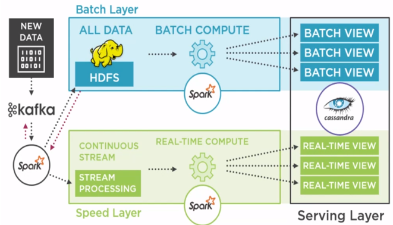

# Lambda-Architecture-ML
In this project, using lambda architecture, I trained a classifier model in batch layer and loaded the trained model to serve the real-time flight arrival delay predictions. 
* Author : Kolli Nethre Sai
## What is Lambda Architecture?
Lambda architecture is a data processing architecture designed to handle massive quantities of data by taking advantage of both batch and stream processing methods. There are three layers in this architecture:
*	Batch Layer
*	Speed Layer
*	Serving Layer
### Use Case: 
Lambda Architecture has multiple use cases, some of them are:
*	Tweeter and Groupon multiple use cases. Lambda architecture is used to understand the sentiment of tweets, so used for sentimental analysis.
*	IOT sensor data analysis.
*	Website’s clickstream data analysis.
* Fraudulent transactions
* Dynamic product pricing
* Store product offers
* Predictive Maintenance
* ETA for delivery etc..
## Setup: 
Download and install:
*	Java 8
*	Python 2.7 (required for Apache Cassandra) 
*	Hadoop 2.7.2
*	Scala 2.11.8
*	Apache Spark 2.0.1
*	Apache Kafka 0.9.0.0
*	Apache Cassandra 2.2.0
*	Intellij Idea IDE (Install Scala plugin)
## Data Flow in Architecure:


## Content:
```
*|__ .idea: Created by Intellij IDE.
*|__ Web-UI: Web-UI files
*|__ spark-lambda
           |__ src
                |__ main
                      |__ resources
                            |__ application.conf: Configuration file.
                      |__ scala
                            |__ batch
                                  |__ BatchJob.scala: Scala code for batch layer where carriers_per_day variable is created and model is trained.
                            |__ clickstream
                                  |__ Logproducer.scala: Scala code for producing the flight-delay data records to kafka.
                            |__ config
                                  |__ Settings.scala: Scala code for declaring lazy vals.
                            |__ domain
                                  |__ package.scala: Scala code for declaring case classes.
                            |__ functions
                                  |__ package.scala: All the functions used for Streaming job are here.
                            |__ streaming
                                  |__ StreamingJob.scala: Scala code for consuming data from kafka, storing in HDFS, creating carriers_per_day variable, and saving the real-time view of carriers_per_day variable in cassandra.
                                  |__ StreamingJobforPredictions.scala: Scala code for taking inputs(features) from kafka, loading the trained model, predicting flight arrival delay and saving that in the Cassandra.
                            |__ utils
                                  |__ SparkUtils.scala: Scala code for spark context, sql context, streaming context is written here.
           |__ pom.xml: Listed all required dependencies for module here. 
*|__ Cassandra: Code for creating cassandra tables.
*|__ README.md: Detailed description of the project.
*|__ data.csv: Flight Delay data.
*|__ lambda.iml: Created by Intellij IDE.
*|__ pom.xml: Listed all required dependencies for whole project here.
```
## Run:
1.	Clone the project into the local system: ```$ git clone git@github.com:nethrekolli/Lambda-Architecture-ML-flightdelay```
2.	Import the project into Intellij IDE.
3.	Create two files referrers.csv and products.csv in lambda/spark-lambda/src/main/resources directory. Add some data into it, so that we can use these two files to generate ‘product’ field and ‘referrers’ field values in the clickstream data.
4.	Run Hadoop, Apache Spark and Apache Cassandra.
5.	Create tables in Cassandra to save the batch views and real-time views. Code for that is in “Cassandra” file.
6.	Run “LogProducer.scala” which generates clickstream data and submits to Kafka.
7.	Run “StreamingJob.scala” which takes data from Kafka, save it to HDFS, process the data saves the real-time views in Cassandra.
8.	Run “BatchJob.scala” which takes data from HDFS, process the data and saves the batch views in Cassandra.
### Standards followed in the project. Here's a gist:
| Literal | Naming Standard | 
| :---         |     :---:      | 
| Module names| all_lower_case    | 
| Class names    | CamelCase       |
| Global and local variables | CamelCase       |
| Functions and methods | CamelCase       |
| Project Name | all-lower-case |
